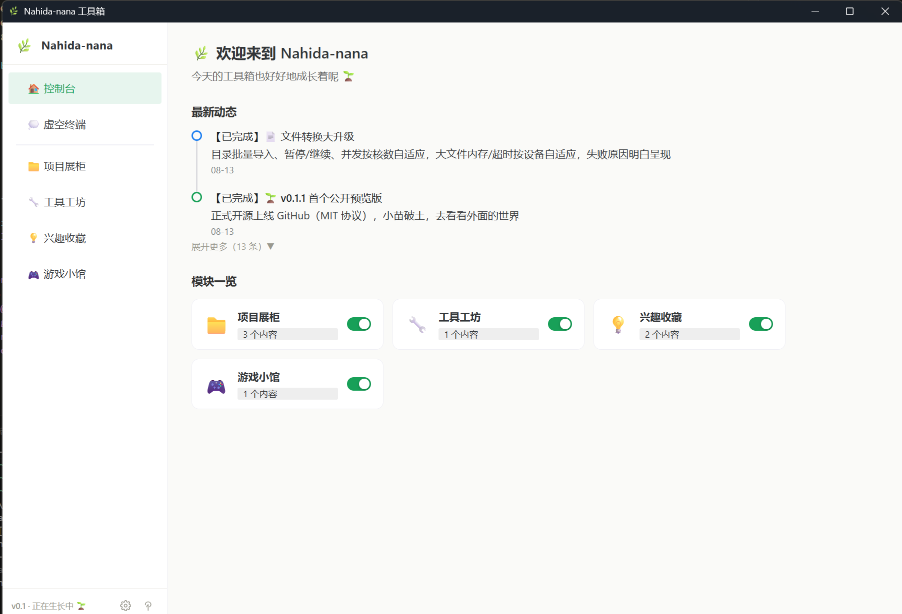
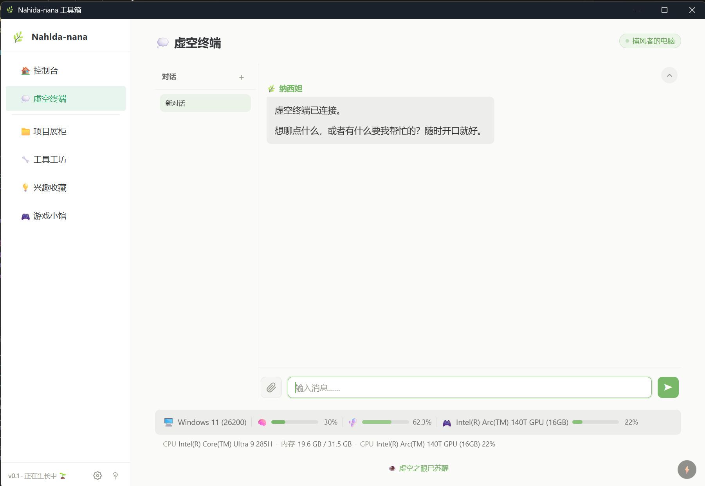
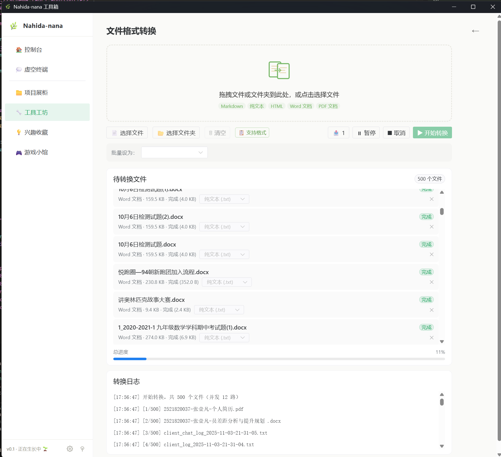

# 🌿 Nahida-nana 工具箱


[](LICENSE)
[](https://github.com/Knot-chord/nahida-nana-toolkit/releases/latest)
[](https://github.com/Knot-chord/nahida-nana-toolkit/releases)

> 一个「用户可编程的本地工具箱平台」—— 想要什么功能就装什么，想怎么改就怎么改，改不了就自己写一个装进去。

**当前版本 v0.1（预览版）· 正在生长中** 🌱

---

## 📖 目录

- [这是什么](#-这是什么)
- [截图](#-截图)
- [你应该看哪里](#-你应该看哪里)
- [下载与安装](#-下载与安装)
- [三分钟上手](#-三分钟上手)
- [功能详解](#-功能详解)
- [开发者指南](#-开发者指南)
- [常见问题](#-常见问题)
- [路线图](#-路线图)
- [致谢](#-致谢)
- [关于](#-关于)

---

## ✨ 这是什么

现有的工具箱软件，要么功能单一不够用，要么大而全却臃肿难用，要么封闭得无法自定义。

这个工具箱的答案是：**内核极简稳定，所有功能都是插件，你完全掌控。**

设计灵魂是纳西妲（草神）——智慧、草木、纯真、梦境。它不只是一个工具集合，更是一个愿意让你打开、探索、停留的数字小花园。

**六大理念**：超轻量 · 高性能 · 高拓展 · 低门槛自定义 · 本地优先 · 有趣驱动

### 为什么是它

- 🪶 **轻量**：基于 Tauri（Rust），安装包仅 ~3 MB，比 Electron 应用小一个数量级
- 🔒 **本地优先**：文件转换、收藏、游戏全部本地运行；AI 也直连你自己的 API，数据不出设备
- 🤖 **AI 原生**：内置纳西妲人格的虚空终端，不只是套壳对话框，而是带技能系统的智慧入口
- 🧩 **可编程**：功能即插件、插件即代码，三层操作设计让小白到极客都能上手

### 核心能力一览

|    | 能力         | 一句话说明                                             |
| -- | ------------ | ------------------------------------------------------ |
| 💭 | 虚空终端     | AI 统一入口：流式对谈 + Skills 技能系统 + 纳西妲人格   |
| 🔧 | 文件格式转换 | md / txt / html / docx / pdf 五格式全互转（20 条路径），文件夹批量导入 |
| 📁 | 项目展柜     | 展示你自己的作品（GitHub 自动拉取 + 手动录入）         |
| 💡 | 兴趣收藏     | 书签管理器，收藏有趣的链接                             |
| 🎮 | 游戏小馆     | 2048 等小游戏，随玩随存                                |
| 📊 | 系统状态     | CPU / 内存 / GPU / 显存实时监控                        |

---

## 📸 截图

<div align="center">

| 控制台 | 虚空终端 | 文件格式转换 |
| :---: | :---: | :---: |
|  |  |  |

</div>

---

## 🧭 你应该看哪里

- 👋 **第一次来**：先看 [下载与安装](#-下载与安装)，再花三分钟走一遍 [上手指南](#-三分钟上手)
- 🛠️ **想参与开发**：直奔 [开发者指南](#-开发者指南)
- ❓ **遇到了问题**：先查 [常见问题](#-常见问题)，再提 Issue

---

## ⬇️ 下载与安装

### 系统要求

- Windows 10 / 11（x64），WebView2 运行时（系统自带）
- 可选：Python 3.10+（仅 PDF 相关转换需要，见[常见问题](#-常见问题)）

### 安装步骤

1. 前往 [Releases 页面](https://github.com/Knot-chord/nahida-nana-toolkit/releases) 下载最新版
   - **推荐**：`Nahida-nana Toolkit_x.x.x_x64-setup.exe`（NSIS，双击安装）
   - 备选：`.msi`（适合企业部署）
2. 双击安装包，按提示完成安装
3. 桌面/开始菜单启动「Nahida-nana 工具箱」

> 首次启动会进入介绍页，之后将直接进入控制台。

---

## 🚀 三分钟上手

### 第一步：配置 AI（使用智慧对谈需要）

1. 左下角 ⚙️ 进入**设置中心**
2. 在 AI 配置中选择服务商（任何 OpenAI 兼容 API 均可），填入你的 API Key
3. 保存——Key 只存在你本地，不出设备

### 第二步：开始对话

1. 侧边栏进入 **💭 虚空终端**，点击输入框
2. 直接开口聊——内置的纳西妲人格技能已自动加载，无需任何配置
3. 需要附件？把图片或 docx / pdf 直接拖进输入框

### 第三步：试试文件转换

1. 侧边栏进入 **🔧 工具工坊 → 文件格式转换**
2. 拖入文件或整个文件夹，选择目标格式，点「开始转换」
3. 多文件并发批量、转换中可暂停/继续、大文件自动降级，全程本地处理

### 让工具箱长成你的样子

- **控制台**可开关四大模块的显隐
- **设置中心 → 插件管理**可按插件粒度启用/禁用
- **设置中心 → Skills**可查看/切换技能，还能把技能目录指到你自己的文件夹

---

## 🎁 功能详解

### 💭 虚空终端 —— AI 统一入口

- **智慧对谈**：OpenAI 兼容 SSE 流式输出，支持中止 / 重试 / 多对话管理
- **Skills 技能系统**（渐进式披露）：元数据索引常驻 → 完整指令按需加载 → 资源按需读取，省 Token 又不漏能力
- **纳西妲人格**：内置常驻技能 `nahida-persona`，随安装包分发，对话自带草木与智慧的气息
- **多模态**：图片 base64 直传，docx / pdf 自动提取文本
- **Token 追踪**：请求 / 响应统计 + 结构化诊断面板

### 🔧 文件格式转换 —— 20 条转换路径

| 源格式 ↓ 目标 → | txt | html | md | docx | pdf |
| ----------------- | --- | ---- | -- | ---- | --- |
| **md**            | ✅  | ✅   | — | ✅   | ✅  |
| **txt**           | —  | ✅   | ✅ | ✅   | ✅  |
| **html**          | ✅  | —   | ✅ | ✅   | ✅  |
| **docx**          | ✅  | ✅   | ✅ | —   | ✅  |
| **pdf**           | ✅  | ✅   | ✅ | ✅   | —  |

双通道架构：不含 PDF 的路径由 **Rust 原生**处理（线程池并发 + 崩溃隔离）；含 PDF 走 **Python 桥接**（PyMuPDF / xhtml2pdf / reportlab）。

- 📂 **文件夹批量导入**：拖入整个目录递归收集受支持文档，并发数按 CPU 核数自适应
- ⏸ **转换中可暂停/继续**，同格式文件自动忽略不计入成败
- 🌏 **编码自适应**：UTF-8 / GBK / GB2312 / UTF-16（带/不带 BOM）老文件直接转
- 🛡 **失败必报原因**：扫描版 PDF 等无文字层文件明确提示，绝不产出空文件冒充成功
- 📈 **资源守卫按设备自适应**：内存预算与超时随物理内存、核数、文件体积自动伸缩

### 📦 其余模块

- **📁 项目展柜**：配置 GitHub 用户名自动拉取仓库，也可手动录入视频/文章/设计作品，按类型筛选
- **💡 兴趣收藏**：书签管理器模式，仅存标题 + 链接，按时间倒序
- **🎮 游戏小馆**：2048（含存档与最高分），更多游戏生长中
- **🏠 控制台**：欢迎语 + 动态时间线 + 模块一览
- **📊 系统状态**：CPU / 内存 / GPU / 显存，启动即预采集，状态栏零等待

---

## 🛠️ 开发者指南

> 三层操作设计：普通用户开箱即用 → 进阶用户设置可调 → 极客直接改源码。每个文件短小精悍、职责单一，代码就是你二次创作的素材。

### 环境准备

Node.js ≥ 18 · Rust ≥ 1.70 · pnpm · Windows 需 VS Build Tools

### 常用命令

```bash
pnpm install                                        # 安装依赖
pnpm dev:desktop                                    # 开发模式（热更新）
pnpm --filter @nahida-nana/desktop exec -- tauri build   # 构筑安装包
```

安装包产物位于 `packages/desktop/src-tauri/target/release/bundle/`。

### 项目结构

```
├── packages/
│   ├── desktop/          # Tauri 桌面应用（主力产品）
│   │   ├── src/          # Vue 3 前端（views / services / stores / plugins）
│   │   └── src-tauri/    # Rust 后端（commands/）+ skills 源目录
│   ├── shared/           # 共享 TypeScript 类型与工具
│   ├── ui/               # 共享 UI 组件库（基于 naive-ui）
│   └── web/              # 网页版（暂停开发，待桌面端稳定后重启）
├── CHANGELOG.md          # 版本更新日志
├── LICENSE               # MIT 协议
└── README.md
```

### 技术栈

Tauri v2（Rust）· Vue 3 · TypeScript · Vite · Naive UI · pnpm workspace · OpenAI 兼容协议

---

## ❓ 常见问题

**Q：安装包这么小，AI 能力从哪来？**
A：AI 走云端 API（用户自备 Key），工具箱不捆绑模型。本地离线 AI 在 v0.2 规划中。

**Q：转换 PDF 时提示需要 Python？**
A：PDF 相关转换通过 Python 桥接实现。安装 Python 3.10+ 后执行 `pip install pymupdf pdfplumber pdf2docx xhtml2pdf reportlab python-docx markdown psutil`（完整清单见 `packages/desktop/src-tauri/resources/scripts/requirements.txt`），重启应用即可。其余格式转换完全不受影响。

**Q：API Key 安全吗？**
A：Key 仅存储在本地（应用数据目录），请求直连你配置的服务商，不经过任何第三方中转。

**Q：Skills 目录在哪？能自定义吗？**
A：默认随应用分发；可在「设置 → Skills」中打开文件夹或改指到任意目录，放入含 `SKILL.md` 的子文件夹并点击刷新扫描即可识别。

---

## 🗺️ 路线图

| 版本     | 定位                                                  | 状态        |
| -------- | ----------------------------------------------------- | ----------- |
| **v0.1** | 预览版：骨架 + 四大模块 + 云端 AI + Skills + 文件转换 | ✅ 当前版本 |
| v0.2     | 本地 AI：模型下载管理 + 离线对话                      | ⬜ 规划中   |
| v1.0     | 正式版：插件 SDK + 安装时可选组件                     | ⬜ 远期     |

详细版本记录见 [CHANGELOG](CHANGELOG.md)。

---

## 💖 致谢

这个工具箱能长出来，离不开这些优秀的开源项目：

- [Tauri](https://tauri.app) —— 让桌面应用轻若羽毛
- [Vue](https://vuejs.org) · [Vite](https://vite.dev) —— 渐进式框架与闪电构建
- [Naive UI](https://www.naiveui.com) —— 完全用 TypeScript 写成的组件库
- [PyMuPDF](https://pymupdf.readthedocs.io) · [xhtml2pdf](https://github.com/xhtml2pdf/xhtml2pdf) —— PDF 世界的瑞士军刀

以及《原神》的纳西妲——她给了这个项目名字与灵魂 🌿

---

## 🙋 关于

一个喜欢折腾的开发者，相信「有趣」是最好的驱动力 🌱

- 开发者：[@Knot-chord](https://github.com/Knot-chord)
- 问题反馈：欢迎提 [Issue](https://github.com/Knot-chord/nahida-nana-toolkit/issues)
- 开源协议：[MIT](LICENSE) —— 自由使用、修改与分发

---

<div align="center">

**🌱 有趣是最好的驱动力——今天的工具箱也好好地成长着呢**

</div>
